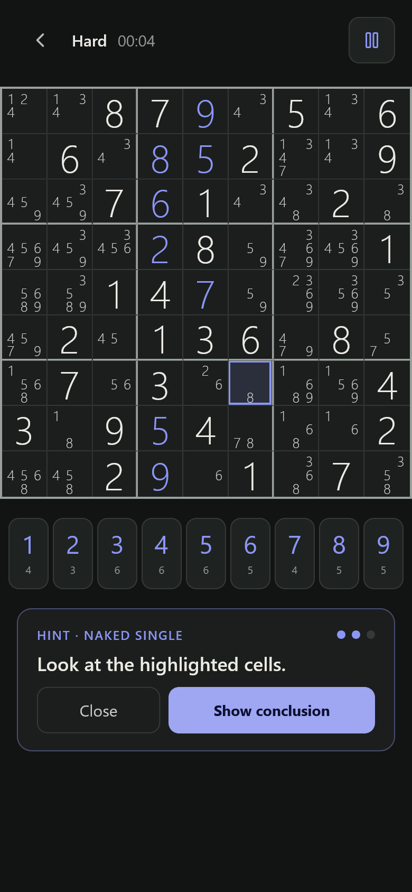
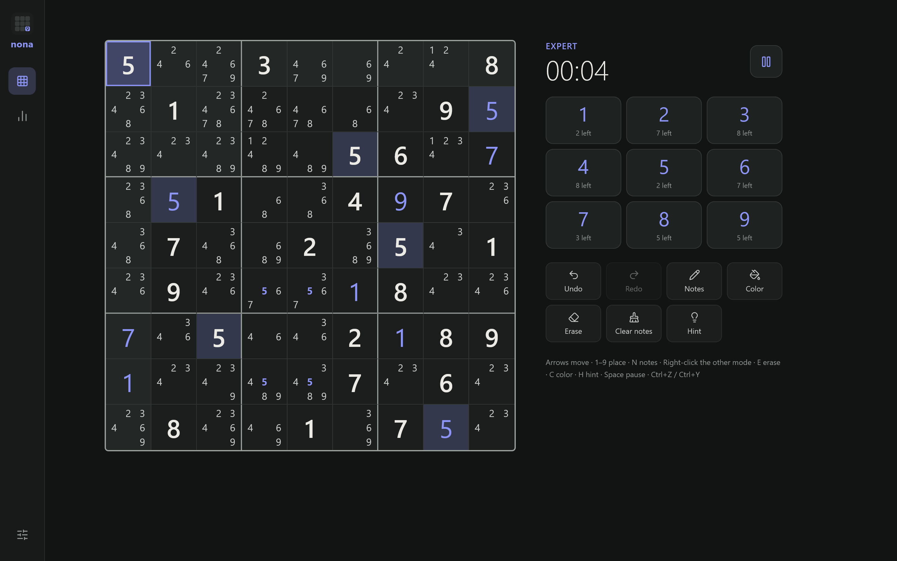
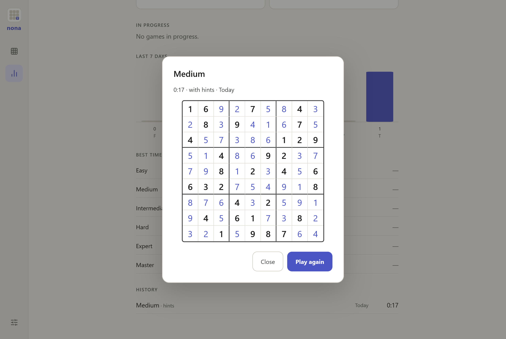

# nona

[](https://memoriainfinita.github.io/nona/)
[](LICENSE)

Sudoku with hints that show you how to solve it, not just the answer.

**Live:** https://memoriainfinita.github.io/nona/



## Hints

A hint comes in steps: the technique, then the cells involved, then the conclusion with its explanation and Apply. It is worked out by a Rust engine compiled to WebAssembly that solves with 45 human techniques.

If some numbers on the board don't match the solution, the hint marks them and offers to remove them before the next step.

## Play

- Six levels, Easy to Master, 500 puzzles each, all with a unique solution
- A daily sudoku, the same for everyone, that changes at midnight UTC
- Two input modes:
  - Number first: tap a number to fix it, then the cells. Tap it again for notes, a third time to let it go
  - Cell first: tap the cell, then the number
- Right-click writes in the other notes mode
- Notes, Fill notes / Clear notes, notes that clean themselves when you place a number
- Eight cell colors, undo and redo, eraser
- Mistakes: Off, Conflicts or Solution



### Keyboard

Arrows move, 1–9 place, N notes, E erase, C color, H hint, Space pause, Ctrl+Z / Ctrl+Y. With the hint open, Enter goes to the next step or applies it, and Esc closes it.

## Stats

Completed games, XP, the last 7 days, best times without hints, and the history. Open a game in the history to see the solved board and play it again.



## Storage

Everything stays in the browser (IndexedDB). Export saves a JSON backup; Import restores it with Merge or Replace.

## Look

Dark and light themes, 7 accents, three number sizes, and layouts for phone, tablet and desktop.

## Browsers

The tests run in Firefox. Vibration works in Chrome for Android; Firefox and iPhone don't vibrate.

## Stack

React 19, Vite 8 and TypeScript; the engine in Rust with wasm-bindgen. pnpm.

The engine is a fork of [kcirtapfromspace/sudoku-core](https://github.com/kcirtapfromspace/sudoku-core) (MIT), [memoriainfinita/sudoku-core](https://github.com/memoriainfinita/sudoku-core), that gives hints on the game's own candidates.

## Scripts

Build the engine first. It needs Rust with the `wasm32-unknown-unknown` target and the wasm-bindgen CLI 0.2.129.

```bash
pnpm build:engine   # engine to WebAssembly
pnpm dev            # development server
pnpm test           # tests (vitest, Node and Firefox)
pnpm build          # production build
pnpm size           # size limits (size-limit)
```

## License

GPL-3.0. See `LICENSE`.

## Credits

Developed by [@memoriainfinita](https://github.com/memoriainfinita) with the assistance of Claude (Anthropic).
